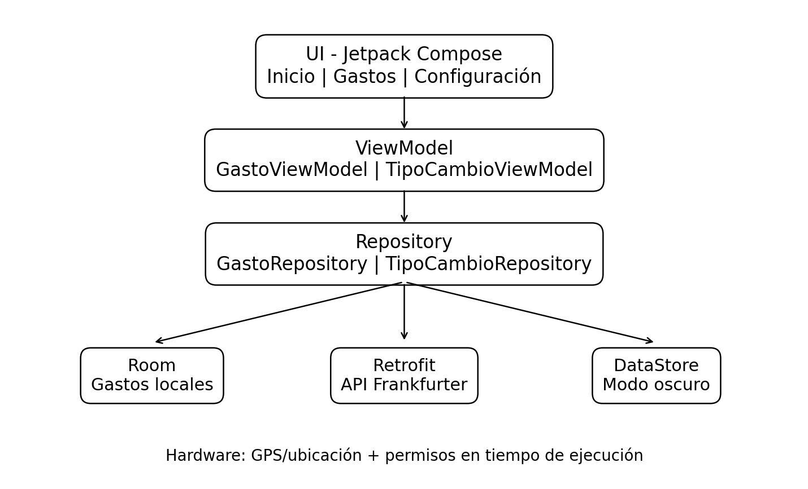
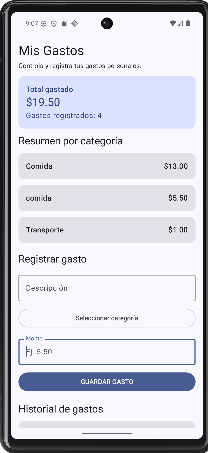
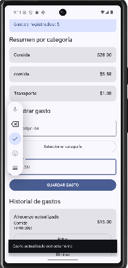
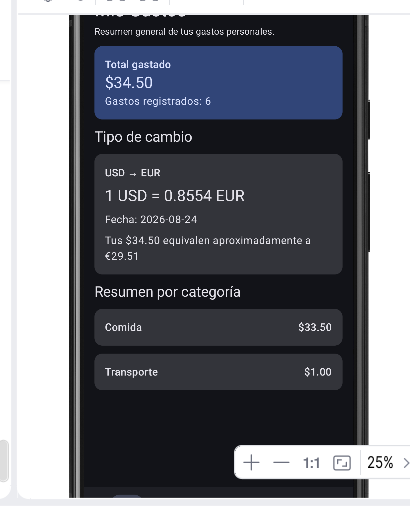
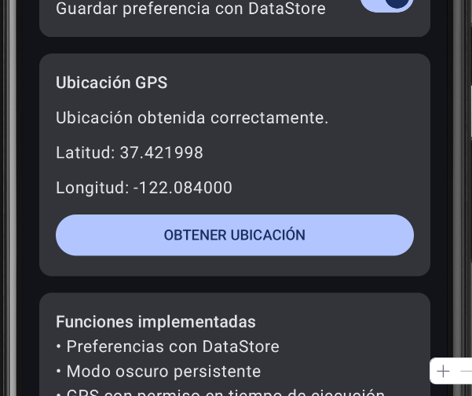

# MisGastos

## Descripción

**MisGastos** es una aplicación móvil Android para el control de gastos
personales. Permite registrar, consultar, editar y eliminar gastos,
visualizar el total gastado y obtener un resumen por categorías.

La aplicación también incorpora persistencia local, preferencias de
usuario, consumo de una API REST y acceso a la ubicación del
dispositivo.

## Arquitectura

La aplicación utiliza la arquitectura **MVVM (Model-View-ViewModel)**
junto con el patrón **Repository**, separando la interfaz, la lógica de
presentación y el acceso a datos.

**Flujo general:**

`UI (Jetpack Compose) → ViewModel → Repository → Room / Retrofit / DataStore`

-   **UI:** pantallas desarrolladas con Jetpack Compose.
-   **ViewModel:** administra y expone el estado de la interfaz.
-   **Repository:** centraliza el acceso a las fuentes de datos.
-   **Room:** almacena localmente los gastos.
-   **Retrofit:** realiza la consulta a la API REST.
-   **DataStore:** guarda la preferencia de modo oscuro.

## API utilizada

La aplicación utiliza **Frankfurter API** mediante Retrofit para
consultar el tipo de cambio de **USD a EUR**. El resultado se muestra en
la pantalla principal y se utiliza para calcular el equivalente
aproximado del total de gastos en euros.

La consulta contempla estados de **carga, éxito y error**.

## Capturas de pantalla

### Pantalla principal

### Registro y edición de gastos

### Consulta de tipo de cambio con Retrofit

### Configuración y ubicación GPS

